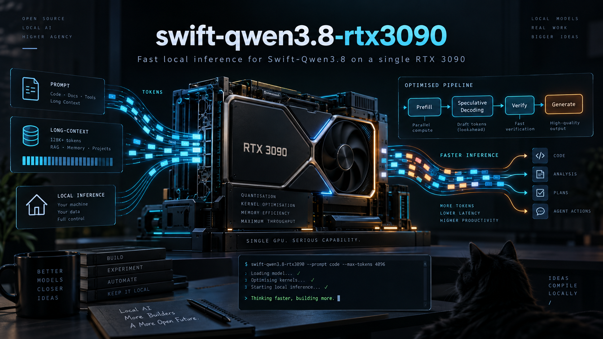
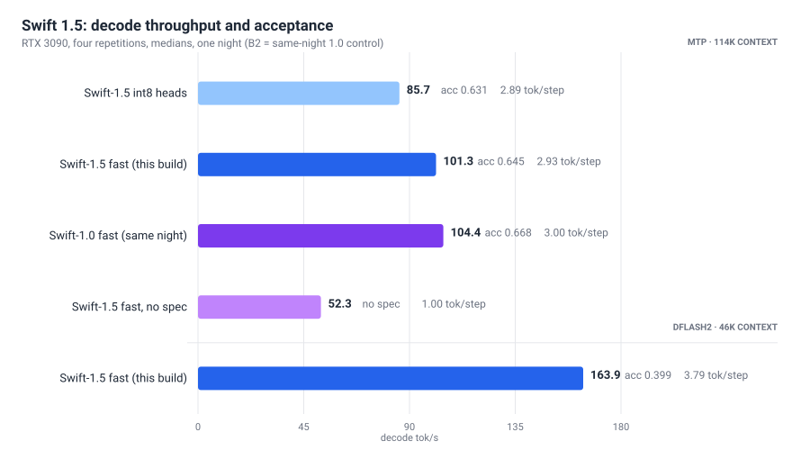

<p align="center">
  
</p>

<h1 align="center">swift-qwen3.8-rtx3090</h1>

<p align="center">
  <strong>Target-calibrated fast variants for Qwen3.8-family checkpoints on a single RTX 3090.</strong>
</p>

<p align="center">
  <a href="#why">Why</a> · <a href="#whats-here">What's here</a> · <a href="#quick-start">Quick start</a> · <a href="#verification">Verification</a> · <a href="docs/benchmarks.md">Benchmarks</a> · <a href="#licensing">Licensing</a>
</p>

---

Reproducibly turn a compatible Swift-Qwen3.8-27B W4A16 checkpoint into a
[syv](https://github.com/syv-ai/qwen38-27b-rtx3090)-optimised single-GPU
**fast variant** with a target-calibrated speculative draft vocabulary,
GPTQ int4 lm_head/MTP, structural verification, and RTX 3090 serving
benchmarks.

A focused companion project, not a fork: it drives the syv stack's own
`drafter/` recipe unmodified and adds what was missing — deriving the
speculative artefacts from the *target* model's own outputs instead of
reusing base-Qwen's.

**Ready-to-serve builds of what this pipeline produces are published:
[liamwh/Swift-1.5-Qwen3.8-27B-W4A16-syv-fast](https://huggingface.co/liamwh/Swift-1.5-Qwen3.8-27B-W4A16-syv-fast)**
(Swift 1.5, current) and
[liamwh/Swift-Qwen3.8-27B-W4A16-syv-fast](https://huggingface.co/liamwh/Swift-Qwen3.8-27B-W4A16-syv-fast)**
(Swift 1.0, unchanged since 2026-09). Both serve unprepared on the syv
stack and carry the licences the Swift Open License requires of
derivatives. This repo remains the way to rebuild either — or to build one
for a different checkpoint.



## Why

The syv stack serves Qwen3.8-27B on a single RTX 3090 in three tiers:

1. generic third-party W4A16 checkpoints can be made servable (int8 heads),
   but every model-specific artefact — the draft vocabulary, the GPTQ
   calibration — still comes from base Qwen;
2. base Qwen itself has a highly optimised fast variant (int4-GPTQ heads,
   own-output draft vocab), worth ~15% plus materially better speculative
   acceptance;
3. nothing existed for a third-party finetune of that family.

That gap is not cosmetic. Speculative artefacts are
distribution-dependent: the MTP drafter scores a ~40k-row slice of
lm_head, and a token outside that slice can never be drafted — every miss
is a guaranteed rejection that truncates the chain. On our workload, the
shipped base-Qwen id list covered **96.7%** of what Swift actually emits;
a list counted over Swift's own outputs covers **99.8%** (99.86% on code),
with only 18,701 of 40,960 ids shared between the two lists. GPTQ
calibration is the same story: Hessians from the target's own hidden
states give an int4 lm_head at KL 0.00234 vs 0.00707 for round-to-nearest.

Measured results (same-night legs, medians, one RTX 3090 — see
[docs/benchmarks.md](docs/benchmarks.md)):

| | decode tok/s | MTP acceptance | quote acceptance |
|---|---|---|---|
| Swift 1.5 int8 (baseline) | 85.7 | 0.631 | 0.962 |
| **Swift 1.5 fast (this pipeline)** | **101.3** | **0.645** | 0.927 |
| Swift 1.0 fast (same-night re-measure) | 104.4 | 0.668 | 0.997 |
| Qwen fast (2026-09 reference) | 98.2 | 0.634 | — |

On Swift 1.5 the fast variant is worth +18% decode over the same
checkpoint's int8 layout and +94% over no speculative decoding (the int8
leg ran first that night, so treat the 18% as an upper bound). Swift 1.5
measured ~3% slower than the 1.0 fast build at this profile. About 78% of
that gap is lower speculative yield (2.93 vs 3.00 tokens per step); step
time differs by 0.7% (28.98 vs 28.78 ms). The two fast directories are the
same size to within 2 MB, so weight bytes don't explain it. Leg order
(1.5, then 1.0) and night-to-night drift are not controlled; see
[docs/benchmarks.md](docs/benchmarks.md). The rebuild also tested the
vocab question: the 1.5-derived list and the 1.0 list each cover ~99.8% of
1.5's held-out output. That shows the tokens the drafter needs barely
changed. It says nothing about the probabilities inside the list.

## What's here

```text
config/workload.example.json   workload mix (categories, weights, think rates)
swift_qwen_syv/
  make_corpus.py               workload-weighted prompt corpus (deterministic)
  vocab_build.py               target draft vocab + held-out coverage/convergence
  quant_heads_multishard.py    int8 heads for multi-shard AWQ checkpoints
  gptq_lm_head.py              GPTQ int4 lm_head, target-calibrated
  requant_mtp.py               GPTQ int4 MTP + fast-variant assembly
  build_fast.sh                end-to-end orchestrator (pinned containers)
verifier/
  verify_model.py              structural model-dir verifier (stdlib core)
  test/                        selftest + fixtures, incl. the stale-tensor
                               collision regression
bench/
  swift_ab.py                  A/B harness: suite/prefix/long/quote/reason/agent
                               modes + acceptance via /metrics counters
  quality_ab.py                9-task quality battery (mechanical checks)
  results/                     committed summaries: fast-ladder.jsonl = Swift 1.0,
                               swift15-ladder.jsonl = Swift 1.5 (+ same-night 1.0 control)
docs/                          methodology, benchmarks, troubleshooting
examples/systemd, examples/nix fail-closed serving-gate patterns
```

## Prerequisites

- One NVIDIA GPU (24 GB; everything here was measured on a 250 W RTX 3090,
  sm86)
- The [syv stack](https://github.com/syv-ai/qwen38-27b-rtx3090) checked
  out and working (`bash verify.sh --install` passes) — its container image
  and `drafter/` tooling are the runtime for the GPU phases
- ~90 GB free disk for the checkpoint, variant dirs and hidden-state
  capture (74 GB memmap, deleted after the build)
- A compatible W4A16 checkpoint (UkisAI's official 1.5 AWQ is public; see
  [Licensing](#licensing))

## Quick start

The worked example is Swift 1.5 (the current target); the identical flow
built the Swift 1.0 variant on TheUnderscore's AWQ.

```bash
# 0. selftest the verifier (stdlib only, ~1 s)
python3 verifier/test/selftest.py

# 1. fetch the official UkisAI W4A16 AWQ of Swift 1.5 into the syv checkout
#    (public; the bf16 MTP module ships as its own indexed shard)
cd $SYV_REPO && python prepare/fetch_thirdparty.py ukisai/Swift-1.5-Qwen3.8-27b-W4A16-AWQ \
  && mv models/Swift-1.5-Qwen3.8-27b-W4A16-AWQ models/Swift-1.5-Qwen3.8-27B-W4A16-syv

# 2. int8 heads (multi-shard aware) + base draft head — serves; keep as rollback
docker run --rm -v $SYV_REPO:/repo -v $PWD:/companion:ro -e HOME=/tmp \
  --entrypoint bash ghcr.io/syv-ai/qwen38-27b-rtx3090:latest \
  -c '/app/venv/bin/python /companion/swift_qwen_syv/quant_heads_multishard.py \
        /repo/models/Swift-1.5-Qwen3.8-27B-W4A16-syv \
      && cd /repo && /app/venv/bin/python prepare/build_draft_vocab.py \
        models/Swift-1.5-Qwen3.8-27B-W4A16-syv --ids prepare/draft_vocab_ids.json'

# 3. your workload corpus — EDIT THE MIX FIRST (config/workload.example.json)
python3 swift_qwen_syv/make_corpus.py --config my-workload.json \
    --out $SYV_REPO/drafter/data/prompts.jsonl

# 4. generate outputs with the target (upstream gen_data.py, ~1.8 h GPU,
#    stop on held-out-coverage plateau — ours levelled at 3,072 of 5,500)
cd $SYV_REPO && venv/bin/python drafter/gen_data.py

# 5. build your draft vocab (compare against the previous target's list if
#    you have one — the overlap is the interesting number)
docker run --rm -v $SYV_REPO:/repo -v $PWD:/companion:ro -e HOME=/tmp \
  --entrypoint bash ghcr.io/syv-ai/qwen38-27b-rtx3090:latest \
  -c '/app/venv/bin/python /companion/swift_qwen_syv/vocab_build.py \
        --gen /repo/drafter/data/gen.jsonl \
        --tokenizer /repo/models/Swift-1.5-Qwen3.8-27B-W4A16-syv \
        --out-ids /repo/drafter/data/swift15_draft_vocab_ids.json \
        --out-report /repo/drafter/data/swift15_vocab_report.json'

# 6-10. capture -> Hessians -> int4 heads -> assemble -> verify, orchestrated;
#       BF16_MTP points at the exporter's own bf16 MTP shard backup
SRC_MODEL=$SYV_REPO/models/Swift-1.5-Qwen3.8-27B-W4A16-syv \
FAST_MODEL=$SYV_REPO/models/Swift-1.5-Qwen3.8-27B-W4A16-syv-fast \
IDS=$SYV_REPO/drafter/data/swift15_draft_vocab_ids.json \
BF16_MTP=$SYV_REPO/models/Swift-1.5-Qwen3.8-27B-W4A16-syv/model-mtp-bf16.safetensors.bak-orig \
GPU_UTIL=0.85 bash swift_qwen_syv/build_fast.sh

# serve it through the syv launchers; verify any time (in-container — the
# build writes root-owned files):
docker run --rm -v $SYV_REPO:/repo -v $PWD:/companion:ro -e HOME=/tmp \
  --entrypoint bash ghcr.io/syv-ai/qwen38-27b-rtx3090:latest \
  -c '/app/venv/bin/python /companion/verifier/verify_model.py \
        /repo/models/Swift-1.5-Qwen3.8-27B-W4A16-syv-fast \
        --ids-source /repo/drafter/data/swift15_draft_vocab_ids.json'
```

Customise the workload mix before trusting any downstream artefact: the
draft vocabulary is only as representative as the corpus. The defaults
approximate one user's coding-agent profile (Rust/TypeScript-heavy) and
are documented as such, not as a universal mix.

### Benchmarking

```bash
BASE=http://127.0.0.1:8090/v1 KEY=... LABEL=swiftfast \
  python3 bench/swift_ab.py suite out.json      # decode/TTFT/acceptance
BASE=... python3 bench/swift_ab.py quote out.json   # 8k-token reproduction
BASE=... THINKING=1 python3 bench/quality_ab.py out.json
```

Acceptance is read from vLLM's `/metrics` spec-decode counters (accepted /
drafted / drafts), so numbers are the server's own view, not a prompt-level
approximation.

## Verification

`verifier/verify_model.py` is the fail-closed replacement for pointing the
upstream verifier at a fast-variant dir (upstream's asserts an int8
lm_head, falsely rejecting the int4-GPTQ layout its own pipeline
produces). It auto-detects the layout and checks:

- config/architecture self-consistency (layer counts vs layer_types,
  attention-interval pattern, untied embeddings)
- compressed-tensors groups: targets, per-group bit widths, symmetry,
  group size, zero-point rules
- packed/scale/shape geometry for lm_head, embeddings, all 8 MTP linears
  and the draft head — checked against bf16 geometry x declared bits
- draft-vocab artefact: unique, in-range ids; rows == draft head rows;
  optional provenance cross-check against your corpus-derived list
- index completeness and a **whole-directory duplicate-tensor scan**: every
  index-mapped name must live in exactly its mapped shard

That last check exists because of a real bug: a hardlinked shard still
carrying superseded int8 MTP tensors passed every existence check and
collided with the int4 tensors at load time. The selftest
(`verifier/test/selftest.py`) includes that exact corruption as a
regression fixture, plus bit-width mismatch, draft-row mismatch,
duplicate-id and missing-shard cases.

Machine-specific concerns (systemd, API keys, ports) are not part of the
library; `examples/` shows the serving-gate pattern instead.

## Upstream relationship

- Generic fixes belong in syv and are contributed there, not carried here:
  verify.sh's int8-only lm_head assertion, and the duplicate-tensor shard
  collision check, are upstreamed separately (see
  [docs/upstream.md](docs/upstream.md) for status).
- Target-specific methodology (workload corpus, own-output draft vocab,
  calibrated GPTQ heads) stays in this companion repo: it is a recipe
  around upstream scripts, not a change to them.
- `quant_heads_multishard.py` generalises upstream's
  `prepare/quant_heads_stream.py` to checkpoints whose heads live in
  different shards. The generalisation has since landed upstream, so this
  copy now only matters for serving pins older than that change.

## Licensing

- **This repo's code**: Apache-2.0 (see LICENSE, NOTICE). It contains no
  model weights, no checkpoint-derived tensors, and no generated outputs —
  only tooling, configs, docs and benchmark summaries.
- **Swift** (ukisai; both 1.0 and 1.5) and its quantisations (UkisAI's
  official 1.5 W4A16 AWQ, TheUnderscore's public 1.0 AWQ) are under the
  Swift Open License v1.0: free for personal/research use and for
  organisations under US$1M annual revenue; above that, commercial use
  needs a separate Swift Enterprise License. The licence grants
  redistribution of derivative works (its sections 2 and 4) provided you
  carry the licence, mark changes, keep attribution, and include the
  Apache-2.0 base-model licence. Both published
  [fast-variant builds](https://huggingface.co/liamwh/Swift-1.5-Qwen3.8-27B-W4A16-syv-fast)
  meet exactly those conditions (the 1.5 one also carries upstream's
  NOTICE). This repo itself still ships no weights — it is the recipe, and
  building from a checkpoint you are authorised to use is what it makes
  reproducible.
- Not legal advice; read the checkpoint card before use.

## Known limitations

- Numbers are for one 27B AWQ body on one RTX 3090 with one stack pin
  (vLLM 0.28.0 + the syv patches). Different body quant, GPU or workload:
  re-measure (that's what `bench/` is for).
- The MTP-vs-DFlash2 "daily profile" conclusion reflects a coding-agent
  workload with long contexts and thinking-on turns; DFlash2 wins raw
  short-context tok/s and remains the better specialised mode there.
- The draft vocab id list is a function of your corpus; a workload mix
  that doesn't match what you serve wastes the coverage gain.
- English-language engineering workload; multilingual output distributions
  will differ (upstream's own experience with a Danish-chat mix is the
  cautionary tale that motivated this repo's existence).

## Attribution

- [syv-ai/qwen38-27b-rtx3090](https://github.com/syv-ai/qwen38-27b-rtx3090)
  (Apache-2.0) — the serving stack, the drafter recipe, and the math this
  pipeline reuses. Three scripts here are derived from it (NOTICE).
- [ukisai/Swift-1.5-Qwen3.8-27b](https://huggingface.co/ukisai/Swift-1.5-Qwen3.8-27b)
  and its official
  [W4A16-AWQ export](https://huggingface.co/ukisai/Swift-1.5-Qwen3.8-27b-W4A16-AWQ)
  — the current target (Swift Open License v1.0; the AWQ carries the
  original Qwen3.8 MTP head bit-identical, which this pipeline relies on).
- [ukisai/Swift-Qwen3.8-27b](https://huggingface.co/ukisai/Swift-Qwen3.8-27b)
  and
  [TheUnderscore/Swift-Qwen3.8-27b-W4A16-AWQ](https://huggingface.co/TheUnderscore/Swift-Qwen3.8-27b-W4A16-AWQ)
  — the Swift 1.0 target (its quantised body, public, Swift Open License
  v1.0).

Swift 1.5 is not a different architecture: it is Swift 1.0 with expanded
post-training (coding/long-horizon/agentic), same Qwen3.8-27B base, same
tokenizer and chat template byte-for-byte, original MTP head retained.
UkisAI's model-quality claims are theirs; the quantisation, calibration,
drafter work and every number in this repo are ours. The narrative
write-up lives on
[veloxide.dev/projects/swift-qwen3-8-rtx3090](https://www.liamwh.com/projects/swift-qwen3-8-rtx3090).
