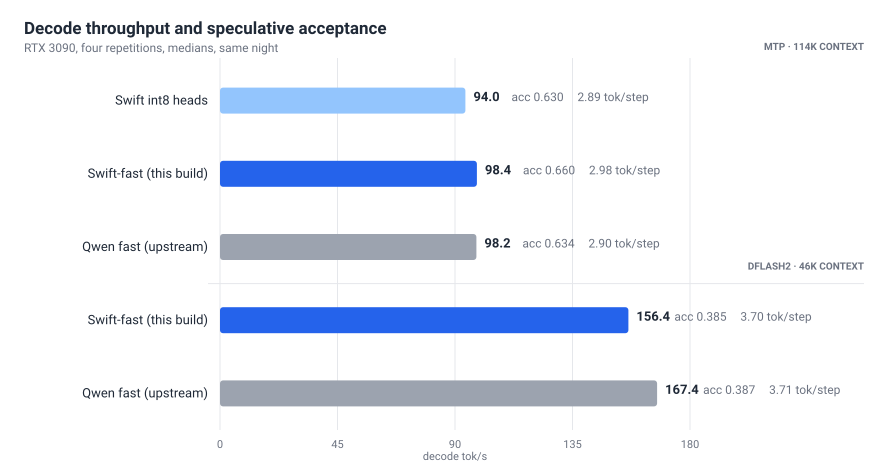
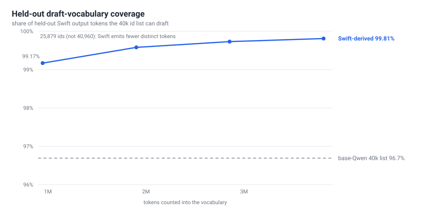
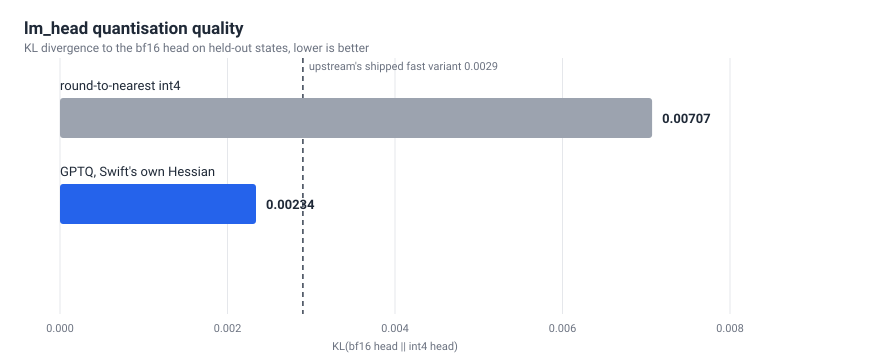

# Benchmarks

All numbers below come from the committed summary artefacts in
[`bench/results/`](../bench/results/) (`profiles.jsonl`, `fast-ladder.jsonl`)
and from the full per-run JSON kept privately on the measurement host; the
harness that produced them is [`bench/swift_ab.py`](../bench/swift_ab.py).
Nothing here is transcribed from memory.

## Hardware and software

| | |
|---|---|
| GPU | 1x RTX 3090 (24 GB, sm86), power limit 250 W |
| Stack | syv-ai/qwen38-27b-rtx3090 @ `bae2023` — vLLM 0.28.0 + KVarN patches, pinned container image |
| Models | `TheUnderscore/Swift-Qwen3.8-27b-W4A16-AWQ` (compressed-tensors W4A16 AWQ, g128) prepared per this repo; base Qwen = upstream's `Qwen3.8-27B-W4A16-AutoRound` + upstream fast variant |
| Sampling (timing runs) | thinking off, T 0.7 / top_p 0.8 unless noted; suite = 4 short + 2 coding prompts, medians over 4 reps |

Variants compared:

- **Swift int8** — W4A16 body, int8 g128 lm_head/embed/MTP, base-Qwen draft ids
- **Swift-fast** — this repo's output: int4-GPTQ lm_head/MTP calibrated on Swift outputs, int8 embed, Swift-own-outputs draft vocab
- **Qwen-fast** — upstream's fast variant for base Qwen (int4-GPTQ heads, own-output draft vocab)

## Fast-variant ladder (`fast-ladder.jsonl`)

All five legs run the same night, REPS=4, medians:

| leg | model / profile | ctx | decode tok/s | acceptance | tok/step | quote tok/s | VRAM MiB |
|---|---|---|---|---|---|---|---|
| A | Swift int8, MTP long | 114,688 | 94.0 | 0.630 | 2.89 | 120–124 | 22,085 |
| **B** | **Swift-fast, MTP long** | 114,688 | **98.4** | **0.660** | **2.98** | 130–132 | 22,225 |
| C | Qwen-fast, MTP long | 114,688 | 98.2 | 0.634 | 2.90 | 128–138 | 22,191 |
| D | Swift-fast, DFlash2 fast | 46,080 | 156.4 | 0.385 | 3.70 | ~300 | 23,081 |
| E | Qwen-fast, DFlash2 fast | 46,080 | 167.4 | 0.387 | 3.71 | ~301 | 23,007 |

Reading it:

- **Swift-fast vs Swift int8**: +4.7% decode, +3pp MTP acceptance. The quote
  workload (8k-token verbatim reproduction) drafts at **0.998 acceptance
  (3.99 tok/step)** — the target-specific vocab made near-perfect drafting
  possible exactly where repetition dominates.
- **Swift-fast vs Qwen-fast on the daily profile**: decode parity (98.4 vs
  98.2) with better acceptance (0.660 vs 0.634).
- **DFlash2 acceptance deficit eliminated** (0.385 vs 0.387 — noise). The
  remaining 156→167 decode gap is the AWQ body's ~0.24 GiB weight-read cost;
  no drafter fixes target-side weight bytes.

## Pre-fast-variant profile ladder (`profiles.jsonl`)

| profile | ctx | decode tok/s | e2e tok/s | TTFT s | quote tok/s | acceptance (suite) | tok/step | VRAM MiB |
|---|---|---|---|---|---|---|---|---|
| Swift MTP long | 114,688 | 101.8 | 91.3 | 0.080 | 140.8 | 0.645 | 2.93 | 22,220 |
| Swift off long (control) | 114,688 | 50.6 | 49.4 | 0.070 | 49.0 | — | 1.00 | 21,058 |
| Swift DFlash2 fast | 46,080 | 139.9 | 113.2 | 0.070 | 284.3 | 0.367 | 3.57 | 23,738 |
| Swift DFlash2 +k15 | 20,480 | 137.1 | 112.1 | 0.060 | **413.7** | 0.368 | 3.65 | 23,372 |
| Qwen DFlash2 fast | 46,080 | 167.2 | 149.3 | 0.070 | 302.9 | 0.387 | 3.71 | 23,066 |
| Qwen MTP long | 114,688 | 92.0 | 86.2 | 0.090 | 146.8 | 0.622 | 2.87 | 21,328 |

(The two Swift ladders were measured on different nights; compare within a
ladder. The B-leg numbers are the ones the fast-variant conclusion rests on.)

## Full A/B, default profiles (thinking off)

| metric | Swift (int8, MTP long) | Qwen (fast, MTP long) |
|---|---|---|
| prefix cache: 8k-doc cold → warm TTFT | 6.32 s → 1.26 s (**5.0x**) | 6.34 s → 1.28 s (**5.0x**) |
| warm decode after cache hit | 118.0 tok/s | 111.7 tok/s |
| long context (33k prompt) TTFT | 28.7 s | 28.8 s |
| long context decode | 89.9 tok/s | 103.6 tok/s |

## Draft-vocab coverage (the mechanism)

Counted over Swift's own outputs (3,072 sequences, 3.8M train tokens,
308 held-out sequences / 417k held-out tokens):

| list | held-out coverage (all) | held-out coverage (code) |
|---|---|---|
| Swift-own-outputs list (25,879 ids built) | **99.81%** | **99.86%** |
| shipped base-Qwen list (40,960 ids) | 96.69% | 96.67% |

Only 18,701 of 40,960 ids are shared between the two lists: nearly half of
the base list is irrelevant to Swift's output distribution, and ~3.1pp of
Swift's actual output was undraftable with it. Convergence: coverage was
99.17% at a quarter of the generation, 99.81% at full — generation was
stopped on that plateau.

GPTQ calibration quality (lm_head KL to bf16, held-out states):
RTN int4 0.00707 → GPTQ int4 **0.00234** (base-Qwen fast variant shipped at
0.0029 on base-Qwen states). MTP relative errors 0.146–0.176, within
upstream's shipped range.

## Quality battery (9 tasks, thinking on, 8192 budget)

Mechanical checks (maths answer, strict JSON, tool-call round-trip,
instruction following, streaming, reasoning parser) + human reading:

| model | pass |
|---|---|
| Swift int8 | 8/9 |
| Swift-fast | 8/9 (identical set) |
| Qwen | 7/9 |

Both models flip on the same hard combinatorics task across samples — task
variance, not a Swift regression. The decisive daily-driver difference:
Qwen exhausted the full 8192-token reasoning budget on both open code tasks
without emitting code; Swift finished the same tasks in 2.5k–7.1k reasoning
tokens and produced correct code. No reasoning-termination regression on
the fast variant.

## Why tok/s was not the only target

A coding agent's wall-clock is dominated by reasoning-token count and
finish rate, not decode speed. In the agent-latency eval (thinking on,
multi-step tasks), Swift-fast and Qwen-fast tie on finish rates; where
answers ship, wall time tracks reasoning-token counts. That is why the
daily profile is **Swift-fast + MTP + long context** (114k ctx, highest
acceptance, best completion behaviour) rather than the faster-on-paper
DFlash2 profile (46k ctx). DFlash2 remains the right mode for
short-context work and for reproduction-heavy sessions (`DFLASH_TOKENS=15`
lifts verbatim reproduction from 284 to 414 tok/s with no effect on
ordinary work).

These conclusions are measurements on ONE RTX 3090, one stack pin, one
workload mix. Do not generalise the MTP-vs-DFlash2 ranking to other GPUs,
quantisation bodies, or workloads without re-measuring; the harness exists
so you can.
