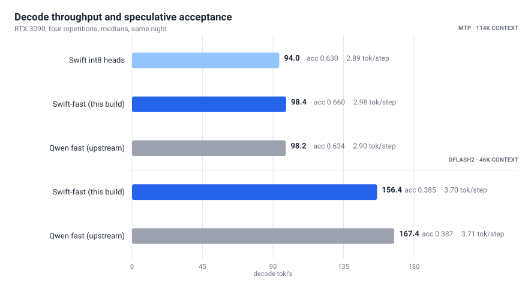
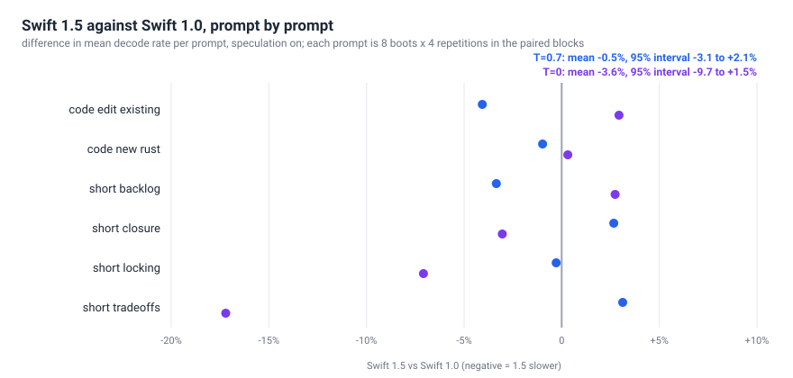
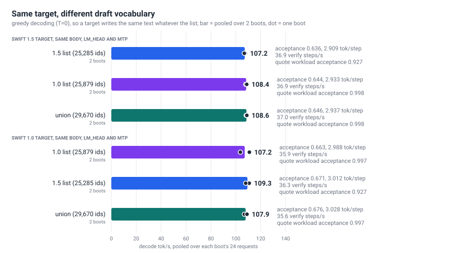
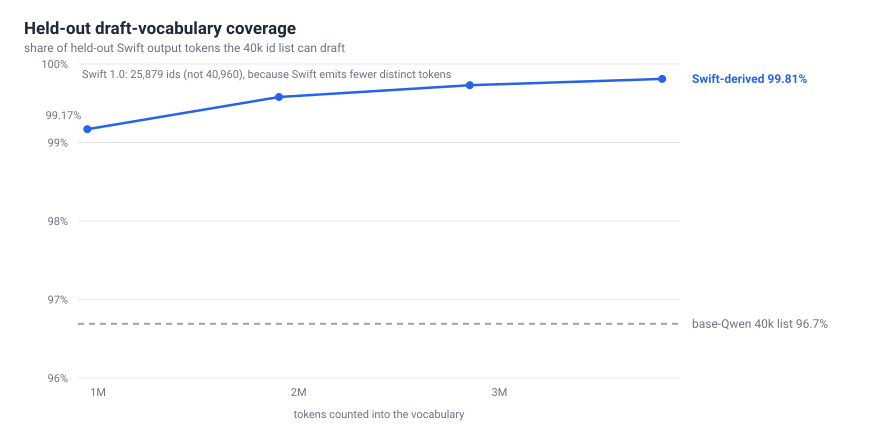
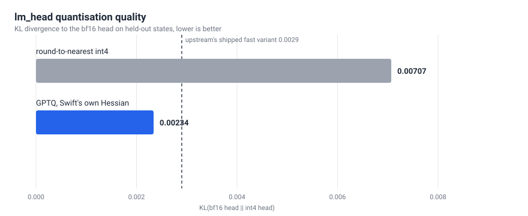

# Benchmarks

All numbers below come from the committed summary artefacts in
[`bench/results/`](../bench/results/) (`profiles.jsonl`, `fast-ladder.jsonl`)
and from the full per-run JSON kept privately on the measurement host; the
harness that produced them is [`bench/swift_ab.py`](../bench/swift_ab.py).
Nothing here is transcribed from memory.

## Hardware and software

| | |
|---|---|
| GPU | 1x RTX 3090 (24 GB, sm86), power limit 250 W |
| Stack | syv-ai/qwen38-27b-rtx3090 @ `bae2023` — vLLM 0.28.0 + KVarN patches, pinned container image |
| Models | Swift 1.0: `TheUnderscore/Swift-Qwen3.8-27b-W4A16-AWQ` prepared per this repo; Swift 1.5: `ukisai/Swift-1.5-Qwen3.8-27b-W4A16-AWQ` (official) prepared per this repo, published as `liamwh/Swift-1.5-Qwen3.8-27B-W4A16-syv-fast`; base Qwen = upstream's `Qwen3.8-27B-W4A16-AutoRound` + upstream fast variant |
| Sampling (timing runs) | thinking off, T 0.7 / top_p 0.8 unless noted; suite = 4 short + 2 coding prompts, medians over 4 reps |

Variants compared:

- **Swift int8** — W4A16 body, int8 g128 lm_head/embed/MTP, base-Qwen draft ids
- **Swift-fast** — this repo's output: int4-GPTQ lm_head/MTP calibrated on Swift outputs, int8 embed, Swift-own-outputs draft vocab
- **Qwen-fast** — upstream's fast variant for base Qwen (int4-GPTQ heads, own-output draft vocab)

## Swift 1.0 fast-variant ladder (`fast-ladder.jsonl`, 2026-09-15)

All five legs run the same night, REPS=4, medians:

| leg | model / profile | ctx | decode tok/s | acceptance | tok/step | quote tok/s | VRAM MiB |
|---|---|---|---|---|---|---|---|
| A | Swift int8, MTP long | 114,688 | 94.0 | 0.630 | 2.89 | 120–124 | 22,085 |
| **B** | **Swift-fast, MTP long** | 114,688 | **98.4** | **0.660** | **2.98** | 130–132 | 22,225 |
| C | Qwen-fast, MTP long | 114,688 | 98.2 | 0.634 | 2.90 | 128–138 | 22,191 |
| D | Swift-fast, DFlash2 fast | 46,080 | 156.4 | 0.385 | 3.70 | ~300 | 23,081 |
| E | Qwen-fast, DFlash2 fast | 46,080 | 167.4 | 0.387 | 3.71 | ~301 | 23,007 |

Reading it:

- **Swift-fast vs Swift int8**: +4.7% decode, +3pp MTP acceptance. The quote
  workload (8k-token verbatim reproduction) drafts at **0.998 acceptance
  (3.99 tok/step)** — the target-specific vocab made near-perfect drafting
  possible exactly where repetition dominates.
- **Swift-fast vs Qwen-fast on the daily profile**: decode parity (98.4 vs
  98.2) with better acceptance (0.660 vs 0.634).
- **DFlash2 acceptance deficit eliminated** (0.385 vs 0.387 — noise). The
  remaining 156→167 decode gap is the AWQ body's ~0.24 GiB weight-read cost;
  no drafter fixes target-side weight bytes.

## Swift 1.0 pre-fast-variant profile ladder (`profiles.jsonl`)

| profile | ctx | decode tok/s | e2e tok/s | TTFT s | quote tok/s | acceptance (suite) | tok/step | VRAM MiB |
|---|---|---|---|---|---|---|---|---|
| Swift MTP long | 114,688 | 101.8 | 91.3 | 0.080 | 140.8 | 0.645 | 2.93 | 22,220 |
| Swift off long (control) | 114,688 | 50.6 | 49.4 | 0.070 | 49.0 | — | 1.00 | 21,058 |
| Swift DFlash2 fast | 46,080 | 139.9 | 113.2 | 0.070 | 284.3 | 0.367 | 3.57 | 23,738 |
| Swift DFlash2 +k15 | 20,480 | 137.1 | 112.1 | 0.060 | **413.7** | 0.368 | 3.65 | 23,372 |
| Qwen DFlash2 fast | 46,080 | 167.2 | 149.3 | 0.070 | 302.9 | 0.387 | 3.71 | 23,066 |
| Qwen MTP long | 114,688 | 92.0 | 86.2 | 0.090 | 146.8 | 0.622 | 2.87 | 21,328 |

(The two Swift ladders were measured on different nights; compare within a
ladder. The B-leg numbers are the ones the fast-variant conclusion rests on.)

## Swift 1.5 controlled session (2026-10-02)

The first Swift 1.5 ladder (below) ran each leg once in a fixed order, so
leg order and night drift were mixed into every comparison. This session
replaced it. 25 container boots, one configuration each, in an interleaved
order, on one RTX 3090 at its default 350 W limit (mean draw 324 to 349 W
while decoding, SM clock 1770 to 1905 MHz, power-capped), same pinned image
(`524805fa`, vLLM 0.28.0 + syv patches), MTP with prefix caching, 114,688
context. Each boot runs one discarded warm-up pass, then the six-prompt
suite four times at T=0.7 (top_p 0.8, seeds 1000 + repetition) and four
times at T=0, then, for the vocabulary legs, the quote workload. A 1 Hz
`nvidia-smi` sampler records clocks, temperature, power and VRAM.

Run order (`bench/controlled_analysis.sh` lists the legs):
`c01 1.0, c02 1.5, c03 1.5, c04 1.0` (ABBA), four no-speculation boots
(1.0, 1.5, 1.5, 1.0), `c09` 1.5 int8, then the 1.5 target with the 1.0
list, the union and the 1.5 list (mirrored), `c16 1.5, c17 1.0, c18 1.0,
c19 1.5` (BAAB), and the 1.0 target with its own list, the 1.5 list and the
union (mirrored). Raw data: `bench/results/controlled/` and
`bench/results/controlled-ladder.jsonl`; analysis:
`bench/results/controlled-summary.json`; session metadata (image id,
revisions, vocabulary hashes, power state): `bench/results/controlled/`.

Rates are pooled tokens over pooled decode time. Steps per second is that
rate divided by tokens per step, `(accepted + steps) / steps`, from vLLM's
own counters. Do not divide a median rate by an aggregate tokens-per-step.
That mixed estimator produced the 34.5 against 34.7 steps per second that
an earlier version of this page quoted.

### Swift 1.0 against Swift 1.5 (8 boots each, each with its own list)

| | T=0.7 tok/s | acceptance | tok/step | verify steps/s | T=0 tok/s | acceptance | tok/step | verify steps/s |
|---|---|---|---|---|---|---|---|---|
| Swift 1.0 fast | 104.6 | 0.668 | 3.005 | 34.8 | 108.6 | 0.663 | 2.988 | 36.3 |
| Swift 1.5 fast (1.5 list) | 103.6 | 0.657 | 2.971 | 34.9 | 104.7 | 0.636 | 2.909 | 36.0 |

| speculation off (4 boots) | T=0.7 tok/s | T=0 tok/s |
|---|---|---|
| Swift 1.0 fast | 52.29 | 52.66 |
| Swift 1.5 fast | 52.24 | 52.60 |

- **Raw target decode is equal.** Speculation off, the two checkpoints
  differ by -0.06% (T=0.7) and -0.09% (T=0). Every prompt is level.
- **MTP throughput is about 1% lower on 1.5 at T=0.7 and about 3.5% lower
  at T=0.** Prompt by prompt the T=0.7 mean is -0.48% (95% interval -3.1 to
  +2.1 when prompts are resampled too, -1.9 to +1.0 for repetitions only;
  3 prompts slower, 2 faster, 1 level), which does not establish a
  difference. The T=0 mean is -3.56% (-9.7 to +1.5), and one prompt
  (`short_tradeoffs`, -17%) carries most of it.
- **The gap is yield, not step time.** Verify steps per second differ by
  +0.2% (T=0.7) and -0.9% (T=0). Tokens per step fall 1.1% and 2.6%.
- **Run-to-run spread is larger than the T=0.7 gap.** The same Swift 1.0
  build pooled between 99.2 and 107.0 tok/s across six boots. Prompts
  differ in speed far more than builds do (per-request IQR 88 to 124), so
  compare prompt by prompt and by adjacent boots, not by the bars alone.
  In the two blocks 1.5 trailed 1.0 by 1.2% and 0.6% at T=0.7, and by 4.6%
  and 2.4% at T=0.
- The fast variant against the int8 heads on 1.5 (one boot, placed ninth):
  98.6 against 103.6 tok/s at T=0.7 (about +5%) and 102.0 against 104.7 at
  T=0 (+2.7%). The first ladder's +18% came from an int8 leg that ran
  first. Against plain decoding the fast variant is 1.98 times faster.

### Draft vocabulary on the Swift 1.5 target (2 boots per list, mirrored)

`swift_qwen_syv/build_vocab_variant.py` builds each variant as a
hardlinked copy of the 1.5 fast directory. Only the id set and the
draft-head rows differ, and each head is rebuilt from the 1.5 lm_head. A
control rebuild of the shipped list reproduced the shipped head tensor for
tensor.

| list | ids | T=0.7 tok/s | acceptance | tok/step | steps/s | T=0 tok/s | acceptance | tok/step | steps/s | quote acceptance |
|---|---|---|---|---|---|---|---|---|---|---|
| Swift 1.5 list | 25,285 | 104.3 | 0.657 | 2.971 | 35.1 | 107.2 | 0.636 | 2.909 | 36.9 | 0.927 |
| Swift 1.0 list | 25,879 | 103.6 | 0.645 | 2.935 | 35.3 | 108.4 | 0.644 | 2.933 | 36.9 | 0.998 |
| union | 29,670 | 106.2 | 0.663 | 2.988 | 35.5 | 108.6 | 0.646 | 2.937 | 37.0 | 0.998 |

Same lists on the Swift 1.0 target (T=0, 2 boots each): acceptance 0.663
(1.0 list), 0.671 (1.5 list), 0.676 (union); quote acceptance 0.997, 0.927
and 0.997.

- **Union against the 1.5 list:** faster in all four paired boots. Pooled
  +1.8% at T=0.7 and +1.3% at T=0. Prompt by prompt +1.60% (-0.9 to +4.2,
  5 of 6 faster) and +0.62% (-1.7 to +2.5, 4 of 6 faster). The prompt-level
  intervals include zero, so this is a consistent small gain, not a proven
  one. The 1.0 list alone was not consistent (-1.3% at T=0.7, +0.9% at
  T=0).
- **The bigger draft head costs nothing measurable.** Steps per second
  went up slightly with the union (35.5 against 35.1, 37.0 against 36.9).
- **The list moves acceptance by about a point; the model moves it by
  two to three.** At T=0 a target writes the same text whatever the list.
  On the 1.5 target acceptance spans 0.636 to 0.646 across lists. At the
  same list the 1.0 target is ahead by 1.9 points (1.0 list), 3.5 (1.5
  list) and 3.0 (union). The model effect dominates the acceptance gap.
  This pins down where the gap is, not why 1.5's text is harder to draft.
- **The quote benchmark measures the list and nothing else.** It gives the
  same acceptance on both targets for the same list. The 1.5 list lacks
  four ids (`logger`, `.getLogger`, `(__`, `__)`) that appear 56 times each
  in the synthetic Python document; the 1.0 list and the union have them.
  Aggregate held-out coverage of 99.8% hid that.
- **Decision:** the union is the recommended Swift 1.5 configuration. The
  tag `vocab-1.5-only` on the Hugging Face repo keeps the earlier revision.

Union input lists, ids and hashes: `data/draft_vocab_ids/`.

## Swift 1.5 first ladder (`swift15-ladder.jsonl`, single pass, superseded)

One boot per leg, in the order F, G, B2, H, I, T=0.7. It is kept as
history. Its 1.0-against-1.5 and fast-against-int8 comparisons were
confounded by leg order and drift; use the controlled session above.

| leg | model / profile | ctx | decode tok/s | acceptance | tok/step | quote tok/s | VRAM MiB |
|---|---|---|---|---|---|---|---|
| F | Swift-1.5 int8, MTP long | 114,688 | 85.7 | 0.631 | 2.89 | 135 | 23,112 |
| G | Swift-1.5 fast, MTP long | 114,688 | 101.3 | 0.645 | 2.93 | 136 | 22,014 |
| B2 | Swift-1.0 fast, MTP long | 114,688 | 104.4 | 0.668 | 3.00 | 145 | 23,042 |
| H | Swift-1.5 fast, no speculative | 114,688 | 52.3 | n/a | 1.00 | 51 | 21,770 |
| I | Swift-1.5 fast, DFlash2 fast | 46,080 | 163.9 | 0.399 | 3.79 | 300 | 23,750 |

The DFlash2 leg was not repeated. VRAM is peak on a card that also runs a
desktop and moves by about 1 GiB on its own.

Swift 1.5 draft-vocab detail (same corpus, same seed, same split as 1.0):
4.31M output tokens over 3,072 sequences, 25,285 ids, held-out coverage
99.79% all / 99.85% code; the Swift 1.0 list covers 1.5's held-out output
at 99.81% / 99.85%, base-Qwen's 40,960-id list at 96.51% / 96.51%.
Intersection with the 1.0 list: 21,494 ids (Jaccard 0.724; 3,791 added,
4,385 removed; union 29,670). lm_head KL: RTN int4 0.00618 → GPTQ int4
**0.00221**; MTP relative errors 0.146–0.189. Coverage measures which
tokens occur, not their probabilities.

Upstream's own claims about Swift 1.5 model quality (thinking-token
reduction, LiveCodeBench/Terminal-Bench movement) are UkisAI's, measured
on their evals; everything on this page is ours, on this GPU.

## Full A/B, default profiles (thinking off; Swift 1.0 era)

| metric | Swift (int8, MTP long) | Qwen (fast, MTP long) |
|---|---|---|
| prefix cache: 8k-doc cold → warm TTFT | 6.32 s → 1.26 s (**5.0x**) | 6.34 s → 1.28 s (**5.0x**) |
| warm decode after cache hit | 118.0 tok/s | 111.7 tok/s |
| long context (33k prompt) TTFT | 28.7 s | 28.8 s |
| long context decode | 89.9 tok/s | 103.6 tok/s |

## Draft-vocab coverage (the mechanism)

Counted over Swift's own outputs (3,072 sequences, 3.8M train tokens,
308 held-out sequences / 417k held-out tokens):

| list | held-out coverage (all) | held-out coverage (code) |
|---|---|---|
| Swift-own-outputs list (25,879 ids built) | **99.81%** | **99.86%** |
| shipped base-Qwen list (40,960 ids) | 96.69% | 96.67% |

Only 18,701 of 40,960 ids are shared between the two lists: nearly half of
the base list is irrelevant to Swift's output distribution, and ~3.1pp of
Swift's actual output was undraftable with it. Convergence: coverage was
99.17% at a quarter of the generation, 99.81% at full — generation was
stopped on that plateau.

GPTQ calibration quality (lm_head KL to bf16, held-out states):
RTN int4 0.00707 → GPTQ int4 **0.00234** (base-Qwen fast variant shipped at
0.0029 on base-Qwen states). MTP relative errors 0.146–0.176, within
upstream's shipped range.

## Quality battery (9 tasks, thinking on, 8192 budget)

Mechanical checks (maths answer, strict JSON, tool-call round-trip,
instruction following, streaming, reasoning parser) + human reading:

| model | pass |
|---|---|
| Swift int8 | 8/9 |
| Swift-fast | 8/9 (identical set) |
| Qwen | 7/9 |

Both models flip on the same hard combinatorics task across samples — task
variance, not a Swift regression. The decisive daily-driver difference:
Qwen exhausted the full 8192-token reasoning budget on both open code tasks
without emitting code; Swift finished the same tasks in 2.5k–7.1k reasoning
tokens and produced correct code. No reasoning-termination regression on
the fast variant.

## Why tok/s was not the only target

A coding agent's wall-clock is dominated by reasoning-token count and
finish rate, not decode speed. In the agent-latency eval (thinking on,
multi-step tasks), Swift-fast and Qwen-fast tie on finish rates; where
answers ship, wall time tracks reasoning-token counts. That is why the
daily profile is **Swift-fast + MTP + long context** (114k ctx, highest
acceptance, best completion behaviour) rather than the faster-on-paper
DFlash2 profile (46k ctx). DFlash2 remains the right mode for
short-context work and for reproduction-heavy sessions (`DFLASH_TOKENS=15`
lifts verbatim reproduction from 284 to 414 tok/s with no effect on
ordinary work).

These conclusions are measurements on ONE RTX 3090, one stack pin, one
workload mix. Do not generalise the MTP-vs-DFlash2 ranking to other GPUs,
quantisation bodies, or workloads without re-measuring; the harness exists
so you can.
