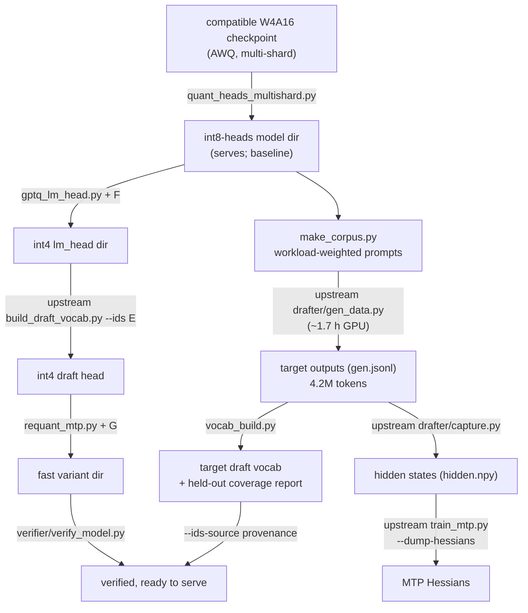

# Methodology: the target-calibrated fast variant

## The three tiers of syv support

The syv stack serves this model family at three levels of optimisation:

1. **Generic third-party checkpoint support** (`prepare/quant_heads_stream.py`):
   any W4A16 compressed-tensors checkpoint can be made servable — lm_head,
   embed_tokens and the MTP module requantized to int8, the base-Qwen draft
   id list bolted on. Works, but every model-specific artefact still comes
   from base Qwen.
2. **The base-Qwen fast variant** (`drafter/`, `prepare/fetch_fast_variant.py`):
   int4-GPTQ lm_head/MTP calibrated on base Qwen's own outputs, a draft
   vocabulary counted over base Qwen's own outputs. Worth ~15% and better
   acceptance — for base Qwen.
3. **A target-calibrated fast variant (this repo)**: the same recipe,
   re-derived from the target model's own outputs. This is what was missing.

## The core insight

The speculative-decoding artefacts are distribution-dependent. The drafter
scores a ~40k-row slice of lm_head; a token outside that slice can never be
drafted, so every miss is a guaranteed rejection that also truncates the
speculation chain. A vocab list counted over *base Qwen's* outputs covered
96.7% of what Swift actually emits — and the missing 3.3% is concentrated
exactly where an agent spends its day (code, tool calls). Likewise, GPTQ
calibration Hessians are a property of the distribution feeding the layer:
hidden states captured from base Qwen are the wrong calibration for a
finetune with a different output style.

So: derive the draft vocabulary AND the GPTQ calibration from the target
model's own outputs, generated on a corpus that mirrors your real workload.
Measured effect on our Swift run: held-out coverage 96.7% → 99.8%, quote
workload acceptance → 0.998, +3pp MTP acceptance overall.

## Pipeline

Step by step (times for 27B on one RTX 3090):

1. **Prepare the checkpoint** — `quant_heads_multishard.py`: int8 g128
   lm_head/embed/MTP from the W4A16 body, handling checkpoints whose heads
   live in different shards. The model now serves with the base-Qwen draft
   list; keep this dir as the rollback.
2. **Generate the corpus** — `make_corpus.py --config workload.json`: 5,500
   workload-weighted prompts (defaults: 35% Rust, 16% TS, 12% debugging,
   10% edit, 8% agent/tool-use, 10% architecture, 7% reasoning, 3% general;
   ~60% thinking-on). Deterministic per seed. Customise to YOUR output
   distribution — the vocab is only as good as the corpus is
   representative.
3. **Generate outputs** — upstream `drafter/gen_data.py` over the corpus
   (3,072 of 5,500 prompts, stopped when held-out coverage plateaued;
   4.2M output tokens, ~1.7 h).
4. **Build the draft vocab** — `vocab_build.py`: 90/10 split, frequency
   count on the train side, specials forced in; reports held-out coverage
   vs your baseline list and a convergence curve so you know when more
   generation stops buying coverage. The list may be shorter than the
   requested cap when the corpus has fewer distinct outputs (ours: 25,879)
   — that is correct behaviour, not a bug.
5. **Capture hidden states** — upstream `drafter/capture.py` over gen.jsonl
   (~1 h; the 74 GB memmap is deleted after the build — regenerable).
6. **MTP Hessians** — upstream `train_mtp.py --eval-only --dump-hessians`
   with your draft ids.
7. **int4 lm_head** — `gptq_lm_head.py`: GPTQ g128 sym from the captured
   Hessian, KL-evaluated against held-out states (ours: RTN 0.00707 → GPTQ
   0.00234).
8. **int4 draft head** — upstream `prepare/build_draft_vocab.py --ids` on
   the int4 lm_head (the drafter must score the same quantised rows it
   drafts from).
9. **Assemble** — `requant_mtp.py`: GPTQ int4 MTP into the variant dir,
   index remapped to model_extra_tensors, and the stale-tensor hazard
   neutralised (see troubleshooting).
10. **Verify** — `verifier/verify_model.py`; wire it as a pre-start gate
    (see examples/) so a bad dir can never boot.

`build_fast.sh` orchestrates 2–10 in pinned containers; the GPU must be
free (the script checks).

## Disk layout and hardlinks

Body shards are hardlink-shared between the int8 dir and the fast dir
(15.2 GB fast dir, mostly shared inodes). Two files must NOT be hardlinks:
`model_extra_tensors.safetensors` (build_draft_vocab rewrites the path —
a hardlink would corrupt the source dir's inode) and, after MTP requant,
`model-nonquant.safetensors` (rewritten norms-only to drop the stale int8
MTP tensors — see troubleshooting). Both scripts handle this; it matters
when you modify them.

## What we deliberately did not do

- **No MTP-head fine-tuning.** Upstream's own negative result (top-1
  agreement unchanged, vLLM acceptance within noise) plus our DFlash2
  acceptance parity after the vocab fix: the remaining drafter upside is
  target-side weight bytes, not drafter quality.
- **No body re-quantisation.** An AutoRound-style symmetric body would buy
  back most of the ~7% DFlash2-profile decode gap (0.24 GiB weight-read)
  but costs the 55 GB BF16 source plus GPU hours; the daily (MTP-long)
  profile is already at parity. Revisit only if DFlash2 becomes your daily
  driver.
- **No DFlash2 head retrained for the target.** Generic-drafter acceptance
  measured at parity (0.385 vs 0.387); expected upside <1%.
